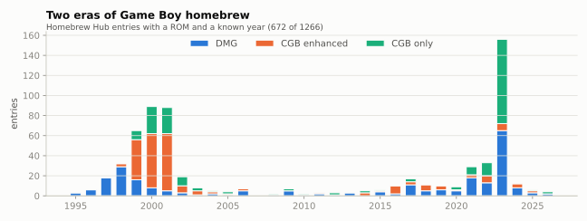
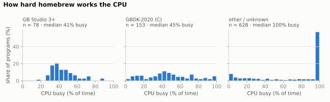
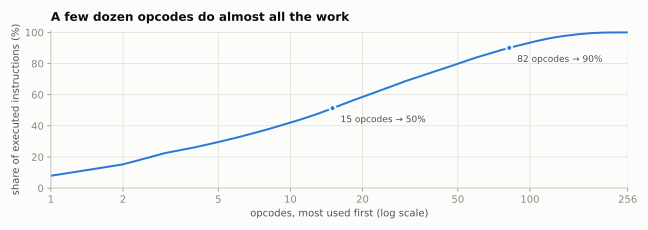
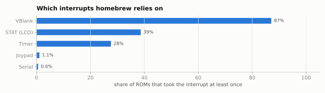
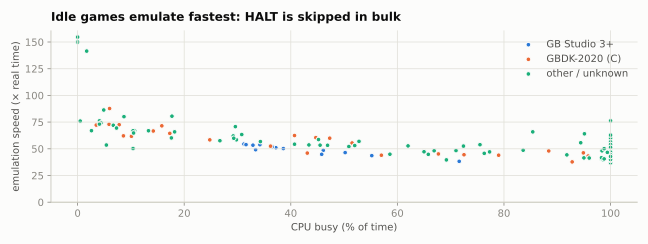

# Game Boy Homebrew Census

*matcha corpus study · 2026-09-29*

Every cartridge in the Homebrew Hub database made for the original Game Boy — 868 of 1,266 — played for one emulated minute by matcha and by SameBoy with identical scripted input. What the software does with the machine, how the two emulators compare, and the three bugs the comparison exposed.

| 1,266 | 868 | 866/868 | 3 |
|---|---|---|---|
| cartridges scanned from Homebrew Hub | made for the original Game Boy, each played for a minute | reach the same outcome in matcha and SameBoy | emulator bugs found by the comparison, fixed |

## Key findings

1. **Two waves of homebrew.** Dated entries cluster in 1997–2002 (337 entries up to 2005) and since 2019 (259), peaking at 156 in 2023. 75% of the second wave carries a GB Studio or GBDK-2020 fingerprint.
2. **Colour is the biggest gap.** 29% of the cartridges are Game Boy Color only; 27 more are flagged as working on a DMG but hang in a Color speed switch, as they would on the hardware.
3. **Old code spins, new code sleeps.** The median program from 1995–2005 keeps the CPU busy 100% of the time; since 2019 the median is 40%, because GB Studio and GBDK halt between frames. 41% of all programs never execute HALT.
4. **A few dozen opcodes do the work.** Weighting every program equally, 15 opcodes make up half of what executes and 82 make up 90%. The top three — `jr e8`, `jr nz, e8`, `ldh a, [$ff00+n8]` — are the busy-wait loop.
5. **GB Studio games lean on raster interrupts.** 99% of them take STAT interrupts, against 39% overall — mid-frame PPU timing matters to them.
6. **The comparison found three matcha bugs:** the post-boot VRAM lacked the boot logo, STOP woke on any button, and OAM DMA did not take over the CPU's bus. With them fixed, the emulators agree on 866 of 868 programs; of the two left, one traces to SameBoy's own boot ROM and the other crashes in both, just differently.
7. **Some homebrew reads memory it never wrote.** Starting RAM with noise instead of zeros changes the outcome of 4 programs.

## 01. Two eras of Game Boy homebrew

[Homebrew Hub](https://hh.gbdev.io) catalogues homebrew, demos and tools for the Game Boy. Its database has 1,266 entries with a ROM file. Parsing each cartridge header gives the hardware it targets: 576 are plain Game Boy (DMG) programs, 323 are flagged as Color-enhanced but DMG-compatible, and 367 (29%) require a Game Boy Color.

Where the entry has a date (672 of them), two waves stand out. The first, 1997–2002, is the scene around the Game Boy Color's release: 75% of its 311 entries target the Color and 56% are demos. The second, since 2019, is mostly games (85%). 66% of its entries were made for competitions and game jams, and 75% carry the fingerprint of one of two toolchains: GB Studio 3's crash handler (found in 250 cartridges overall) or GBDK-2020 library code (213).

*Homebrew Hub entries with a ROM and a known year (672 of 1,266).*

1,204 cartridges pass the checks the DMG boot ROM performs (logo and header checksum). Every one of them uses a mapper matcha implements (MBC1, 2, 3, 5 or none); the 31 entries with other cartridge types all fail the logo check, so they are not bootable cartridge images. Setting those and the Color-only cartridges aside leaves 868 programs made for the original Game Boy: the corpus for everything below. (30 of them fail the boot ROM's checks and would not start on a real console; both emulators run them anyway.)

## 02. One minute of play, four outcomes

Each program ran for 60 emulated seconds (3,584 frames) with a scripted "monkey" player: Start and A every two seconds for the first ten seconds, then a random direction with A/B every eight frames. The run is classified by what the screen and CPU did: **running** (the picture changed), **static** (one picture the whole minute), **blank** (never more than a frame or two of anything), or **crashed** (the CPU hit an illegal opcode and locked up).

| Outcome | matcha | SameBoy | matcha, DMG programs | matcha, Color-flagged |
|---|---|---|---|---|
| running | 788 | 788 | 544 | 244 |
| static | 42 | 41 | 16 | 26 |
| blank | 29 | 29 | 0 | 29 |
| crashed | 9 | 10 | 2 | 7 |

91% of the programs run. The failures concentrate in Color-flagged cartridges: 29 of the 29 blank screens and 7 of the 9 crashes. 27 Color-flagged programs sit in STOP for most of the minute: replaying each with `matcha trace --input monkey --last 40` shows it writing KEY1, the Color's speed-switch register, just before STOP — code meant for a Color. On an original Game Boy, STOP then waits for a button whose row nobody selected. 8 static programs never draw anything themselves and leave the boot logo on screen.

## 03. matcha against SameBoy, program by program

Test suites check what their authors thought to test. Running the whole corpus through a second, independent emulator checks everything else. SameBoy — among the most accurate Game Boy emulators — ran every program with matcha's exact input schedule and screen metrics (a small C harness around its core, in `analysis/reference/`), starting RAM at zero as matcha does.

Disagreements were chased to their first diverging instruction with side-by-side instruction traces of both emulators. They exposed three matcha bugs, and fixing them resolved all but two:

- **Post-boot VRAM.** The DMG boot ROM leaves the cartridge's logo in VRAM; matcha started with it empty, so programs that never clear VRAM showed a blank screen instead of the logo.
- **STOP.** matcha woke from STOP on any button press. On a DMG only a selected button row can end it, a held button turns STOP into HALT, and the clock really stops (PPU, timer and APU freeze). Color programs attempting a speed switch now hang as on hardware instead of running on into garbage.
- **OAM DMA bus conflicts.** While DMA copies to OAM it owns the bus it reads from; a CPU fetching code from ROM at that moment reads the DMA's bytes. Demos that start DMA from ROM (where games copy the routine to HRAM) diverged within a frame. Gambatte's hardware-verified oamdma tests then pinned the timing: 143 → 333 of 393 pass.

| matcha version | Same outcome as SameBoy |
|---|---|
| `22c3fcc` before the comparison | 831 of 868 |
| `9e9b8be` + boot logo in VRAM, DMG STOP | 858 of 868 |
| `2f864c7` + OAM DMA bus conflicts | 866 of 868 |

Two differences remain. `hybrid-gbplot` reads STAT a few instructions after boot and branches on the PPU mode. SameBoy runs its own DMG boot ROM, which hands over at a different point of the frame than Nintendo's: Mooneye's `boot_hwio` and `boot_div` tests, which matcha passes, fail in SameBoy with that boot ROM. `child-s-play` goes off the rails in both: 45 seconds in, `matcha trace` shows it executing data from $0000 with the stack at $0BC5 until it reaches a STOP byte, while SameBoy's run reaches an illegal opcode at 47 seconds — so one counts as crashed and the other does not.

Pictures agree pixel for pixel too. A static screen is a picture held for half a second; of the 802 programs that showed one in both runs, 786 share at least one bit-identical screen and for 525 the sets are the same. Where sets differ, the likely cause is timing rather than drawing: the boot ROMs hand over at different PPU phases, so a button press lands at a different point of a program's frame and the runs catch different in-between pictures.

## 04. Old code spins, new code sleeps

A Game Boy program that has finished its frame's work can HALT until the next interrupt, saving battery; or it can spin in a loop polling LY or STAT. The profiler counts every M-cycle as busy, halted or stopped. Across the 859 programs that did not crash, the median keeps the CPU busy 75% of the time, and 41% never execute HALT at all.

*Distribution per toolchain; the right-most bar (95–100% busy) is mostly programs that never halt.*

The split is generational. GB Studio (median 41%, 0% never halt) and GBDK-2020 (median 45%) wait for VBlank with HALT; hand-written code of the first wave mostly spins (median 100% for 1995–2005, 70% never halt). For an emulator this matters because halted time is nearly free: matcha skips it in bulk (see the HALT fast path in docs/ARCHITECTURE.md).

## 05. A few dozen opcodes do almost all the work

The programs executed 14,294,244,753 instructions. Weighting every program equally, 15 opcodes make up half of them, 51 make up 80% and 82 make up 90%; the CB prefix (bit operations, shifts, `swap`) accounts for 3.7%.

*Opcodes ranked by their average share across programs.*

| # | Instruction | Share |
|---|---|---|
| 1 | `jr e8` | 7.9% |
| 2 | `jr nz, e8` | 7.3% |
| 3 | `ldh a, [$ff00+n8]` | 7.3% |
| 4 | `prefix cb` | 3.7% |
| 5 | `jp a16` | 3.4% |
| 6 | `and n8` | 2.9% |
| 7 | `cp n8` | 2.8% |
| 8 | `jp nz, a16` | 2.4% |
| 9 | `ld a, [a16]` | 2.4% |
| 10 | `ld a, n8` | 2.0% |

The top three are the busy-wait loop — load a hardware register, test it, jump back. Compiled code has its own fingerprint: `ld hl, sp+e8`, the SDCC compiler's way of reaching local variables, ranks #3 in GB Studio games and #3 in GBDK programs, but #22 in everything else. Within the CB prefix, `swap a` alone is 21% — the usual way to split a byte into BCD or hex digits.

## 06. What homebrew listens to

87% of the programs take the VBlank interrupt, 39% the STAT (LCD) interrupt, 28% the timer — a common way to pace music — and almost none the serial port (0.6%) or joypad (1.1%). 11% use no interrupts at all.

STAT is the raster-effect interrupt: it fires at a chosen line or mode, and code that runs then changes scroll registers or palettes mid-frame. 99% of GB Studio games take it, against 26% of other code. That is the case for a pixel-accurate PPU (roadmap item 2).

## 07. What happens if RAM starts with noise

Real Game Boy RAM powers up with a noisy bit pattern, not zeros. SameBoy emulates that; matcha starts at zero so runs are reproducible. Running SameBoy again with its DMG noise pattern (fixed seed) changed the outcome of 4 programs (0.5%) — 3 crash with noise, 1 only runs with it — and 56 programs showed at least one different static screen.

These are programs that read memory before writing it. One of them, the music tool Fatass Tracker, draws bytes from uninitialised RAM until it meets an end marker ($FB or above). With zeros it never finds one, writes on past its buffer over its own variables and crashes — in both emulators; with noise it stops early and runs.

| SameBoy, zero RAM | SameBoy, noisy RAM | Programs |
|---|---|---|
| blank | crashed | 1 |
| crashed | running | 1 |
| running | crashed | 1 |
| static | crashed | 1 |

## 08. Idle games emulate fastest

On one core of the 2-vCPU build container, with the profiler off and the same scripted input, a random sample of 150 programs ran at a median 52× real time (the slowest 37×). Speed follows CPU load (correlation -0.62): programs busy under 30% of the time run at a median 68×, those busy more than 95% of the time at 47×.

*Random sample of 150 programs.*

## 09. What this means for matcha

- **Game Boy Color mode first.** 29% of the corpus cannot run without it, and most failures in the rest are Color programs.
- **Then a pixel FIFO.** 39% of programs use raster interrupts; Mealybug and Gambatte's mid-mode-3 tests are the remaining PPU gaps.
- **Keep differential testing.** The SameBoy harness found three bugs that the suites matcha ran had missed; CI can run it on a sample of the corpus.
- **Offer noisy power-on RAM** as an option: 4 programs depend on it.
- **Keep HALT cheap.** GB Studio and GBDK programs spend more than half their time halted; bulk-skipping it is why matcha runs them fastest.

## 10. Data, method and caveats

- **Corpus.** [gbdev/database](https://github.com/gbdev/database) at commit `5029355` (2026-09-19): every entry's default `.gb`/`.gbc`. Headers parsed by `analysis/build_manifest.py`; ROMs are not redistributed.
- **Toolchain fingerprints.** Byte signatures for GB Studio 3+ and GBDK-2020 agree with every entry whose authors tagged the tool (15 GB Studio, 6 GBDK) and fire on none of the 413 entries dated before 2019. Older GB Studio and GBDK versions and assembly are not told apart (803 "other / unknown").
- **Play.** 60 emulated seconds per program with the scripted monkey input, identical in both emulators (`InputDriver` in `crates/matcha-cli/src/profile.rs`). A minute of random input is not a playthrough: the median program started instructions at only 4.0% of its ROM's byte addresses (ROMs also hold graphics and data).
- **Reference.** SameBoy at commit `213a12c`, DMG-B model, its open-source DMG boot ROM, RAM at zero (and, for section 07, noise with a fixed seed). SameBoy is a reference, not ground truth; its boot ROM hands over at a different PPU phase than Nintendo's.
- **Outcomes.** Crashed = illegal opcode; blank = at most two frames that are not one uniform colour; static = one distinct picture among every 15th frame; running = anything else. Static screens are FNV-1a hashes of pictures held for 30 frames, computed the same way in both harnesses.
- **Reproduce.** `analysis/README.md` lists the commands; `analysis/data/` holds every input and `summary.json` every number quoted here.
